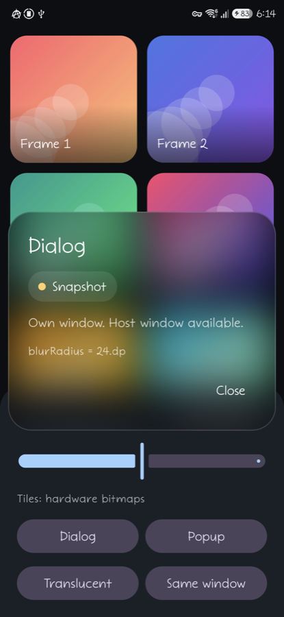
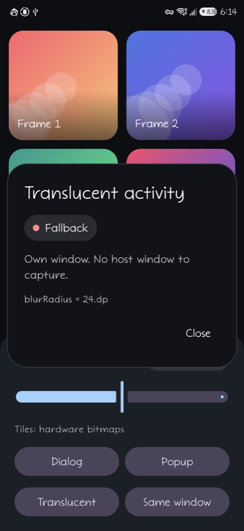

# Underlay

[](https://central.sonatype.com/artifact/com.timkrest/underlay)
[](https://github.com/timkrest/Underlay/actions/workflows/ci.yml)

[English](README.md)

Размытая подложка для диалогов и оверлеев, живущих **в собственном окне**, начиная с API 23.

| `Snapshot` под `Dialog` | `Fallback` в прозрачной активити |
|---|---|
|  |  |

Оба кадра — из `:sample` на одном устройстве.

```kotlin
Dialog(onDismissRequest = ::dismiss) {
    Box(
        modifier = Modifier
            .fillMaxSize()
            .blurredUnderlay(
                blurRadius = 16.dp,
                tint = Color.Black.copy(alpha = 0.3f),
                fallback = MaterialTheme.colorScheme.surface,
            ),
    ) {
        // содержимое диалога
    }
}
```

## Зачем это нужно

Compose-библиотеки размытия — [haze](https://github.com/chrisbanes/haze),
[Cloudy](https://github.com/skydoves/Cloudy), [imla](https://github.com/desugar-64/imla) — размывают
поддерево композиции: помечаешь его модификатором, они снимают поддерево в `GraphicsLayer` и
размывают этот слой.

`Dialog` рисуется в **отдельном окне**, а содержимое за ним принадлежит окну активити — другому
дереву render node. Модификатор внутри диалога до него не дотянется. Пробел в платформе отслеживается
апстримом: [Support window blur in compose dialogs](https://issuetracker.google.com/issues/296272625).

Underlay закрывает только этот случай. Для размытия внутри своего окна берите haze или Cloudy —
они совмещаются: Underlay даёт подложку, haze рисует живой эффект поверх.

## Как деградирует

Подложка берётся из лучшего источника, который даёт устройство:

| Источник | Требует | Что происходит |
|----------|---------|----------------|
| `SystemBlur` | API 31+, своё окно | `FLAG_BLUR_BEHIND` + `blurBehindRadius`. Живое, на GPU, бесплатно. Сверху рисуется только тинт. |
| `Snapshot` | API 23+, достижимое host-окно | Один `PixelCopy` host-окна (`decorView.draw()` ниже API 26), уменьшение ×4 и размытие: `RenderEffect` на GPU начиная с API 31, box-проходы на `Dispatchers.Default` ниже. |
| `Fallback` | — | Сплошной цвет `fallback`. |

Захват занимает границу кадра, `PixelCopy` и размытие. Пока он не готов, модификатор сообщает
четвёртое значение, `Pending`, и рисует только тинт: оверлей проявляется из чистого содержимого
host-окна в размытый снимок, а не мигает непрозрачным `fallback`.

В режиме энергосбережения система выключает межоконное размытие. Underlay слушает это через
`WindowManager.addCrossWindowBlurEnabledListener`, снимает флаг окна и проваливается на снимок.

Снимок использует `PixelCopy` везде, где тот есть. `decorView.draw()` в программный canvas бросает
`Software rendering doesn't support hardware bitmaps`, как только загрузчик картинок декодировал
что-нибудь на экране в hardware bitmap, — а начиная с API 26 это поведение Coil и Glide по умолчанию.

## Окна

Underlay резолвит два окна: то, в котором живёт вызывающий, и host-окно под ним.

| Откуда вызвано | Своё окно | Host-окно | Лучший источник |
|----------------|-----------|-----------|-----------------|
| `Dialog` | окно диалога | окно активити | `SystemBlur` |
| `Popup`, `PopupWindow` | корневая View через `WindowManager` | окно активити | `SystemBlur` |
| Прозрачная или плавающая активити | окно активити | нет — принадлежит другой задаче | `SystemBlur` |
| Обычный оверлей внутри активити | нет | нет | `Fallback` |

Без своего окна host-окном оказывается собственное окно вызывающего, и захват свернул бы оверлей в
его же подложку. В этой строке рисуется `fallback`.

У прозрачной активити host-окна тоже нет, поэтому она падает из `SystemBlur` сразу в `Fallback`,
тогда как `Dialog` или `Popup` опустились бы до `Snapshot`.

## Отчёт о текущем источнике

```kotlin
Modifier.blurredUnderlay(
    blurRadius = 16.dp,
    tint = Color.Black.copy(alpha = 0.3f),
    fallback = MaterialTheme.colorScheme.surface,
    onSourceChange = { source -> Log.d("underlay", "source: $source") },
)
```

`UnderlaySource` — это `SystemBlur`, `Snapshot`, `Pending` или `Fallback`. Колбэк срабатывает на
каждое изменение, включая провал вниз, когда система выключает межоконное размытие.

## Обновление снимка

`Snapshot` замораживает host-окно. Чтобы снять его заново, пока оверлей открыт, передайте
модификатору `UnderlayState`:

```kotlin
val underlay = rememberUnderlayState()

Box(
    modifier = Modifier.blurredUnderlay(
        blurRadius = 16.dp,
        tint = Color.Black.copy(alpha = 0.3f),
        fallback = MaterialTheme.colorScheme.surface,
        state = underlay,
    ),
) {
    Button(onClick = { underlay.refresh() }) { Text("Обновить") }
}
```

Снимок на экране остаётся до готовности нового, поэтому обновление не мигает. `SystemBlur` размывает
вживую и состояние игнорирует.

## Установка

```kotlin
dependencies {
    implementation("com.timkrest:underlay:0.2.0")
}
```

`minSdk 23` — тот же минимум, что объявляет сам Compose, — и байткод Java 11. Зависимости: Compose
runtime и UI, отданные через `api`, плюс `activity-compose`, `core-ktx`, `annotation` и
`kotlinx-coroutines-core`.

## Совместимость

Публичная поверхность записана в [`underlay/api/underlay.api`](underlay/api/underlay.api) и
проверяется на каждой сборке.

- **Патч-релиз не ломает ничего** — ни по исходникам, ни по бинарнику.
- **До 1.0.0 минорный релиз может сломать**, и тогда об этом сказано в чейнджлоге. CI не пропустит
  релиз, который убирает объявление, не выходя из своей серии.
- **Kotlin манглит каждую сигнатуру с `Dp` или `Color`** — `blurredUnderlay-6Ivg_Sk`. Добавление
  параметра переименовывает её, поэтому релиз может не тронуть ваши вызовы и всё равно потребовать
  пересборки. Релиз, который требует править и сам вызов, говорит об этом в чейнджлоге.

## О чём стоит знать

- **Снимок заморожен.** Он захватывает host-окно один раз, ещё раз — когда окно меняет размер или
  конфигурацию, и по `UnderlayState.refresh()`. Движение под ним само по себе не подхватывается; для
  всплывашки над прокручивающимся списком берите библиотеку, работающую внутри окна. Неудавшийся
  перезахват оставляет снимок на экране — кроме случая, когда host сменил размер и старый кадр
  больше не совпадает: тогда до успешного захвата рисуется `fallback`.
- **`FLAG_BLUR_BEHIND` — флаг окна.** `SystemBlur` размывает всё за окном оверлея целиком,
  `Snapshot` — только то, что за композаблом. Вешайте модификатор на композабл, заполняющий окно
  оверлея, чтобы оба источника давали одну картинку.
- **`blurRadius` — это сигма гауссианы**, тот же смысл, что у Figma и
  `RenderEffect.createBlurEffect`; в `Snapshot` берётся уже от уменьшенного ×4 кадра. На CPU сигма
  становится радиусом бокса, три прохода которого дают ближайшую к ней сигму:
  `radius = (sqrt(4*sigma^2 + 1) - 1) / 2`, округлённый к ближайшему из двух соседей.
- **Host — всегда окно активити.** При диалоге поверх диалога `Snapshot` снимает активити, а не
  промежуточный диалог. У `SystemBlur` этого шва нет.

## Сэмпл

`:sample` открывает по оверлею на каждый вид окна — `Dialog`, `Popup`, прозрачная активити, обычный
оверлей внутри окна — поверх сетки hardware bitmaps, показывает активный источник и даёт таскать
радиус. При активном `SystemBlur` подсказывает про энергосбережение: так провал в `Snapshot` можно
увидеть на живом устройстве.

```bash
./gradlew :sample:installDebug
```

## Границы

Kotlin Multiplatform не планируется. Пробел, который закрывает библиотека, — андроидный: в Compose на
iOS диалоги рисуются в той же иерархии View, границы окна там нет, а размытие уже закрыто
`UIVisualEffectView`. У десктопа граница есть, но общего с `FLAG_BLUR_BEHIND` и `PixelCopy` ничего —
это была бы вторая реализация, а не общий код. Переносимо здесь только box-размытие.

## Лицензия

Apache 2.0 — см. [LICENSE](LICENSE).
