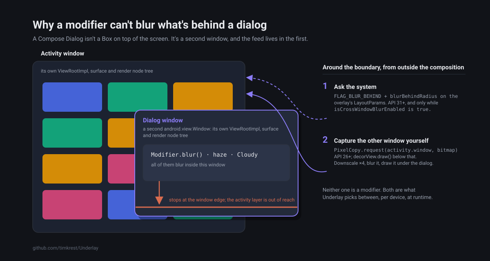

# Blur behind a Compose dialog: why haze can't do it and what can

[Русская версия](article-window-boundary.ru.md)

A designer sent me a mockup: a card over a feed, frosted glass under the card. I wired up
[haze](https://github.com/chrisbanes/haze), and the dialog blurred itself: the card's own contents
went soft, and the feed behind it stayed perfectly sharp.

Swapping haze for `Modifier.blur()` gave the same result. So did reordering the modifiers, wrapping
the whole thing in a `Box` and moving the modifier up to the parent.

Nothing is broken, neither haze nor Compose. The dialog is a separate window, and the rest of this
post is about that boundary and how to get around it, from API 23 up.

## Why a modifier can't reach the backdrop

A Compose `Dialog` isn't a `Box` on top of the screen. It's an `android.view.Window`, a separate
window with its own `ViewRootImpl`, its own surface and its own render node tree. The dialog's
composition lives inside that window. The feed you want blurred lives in the activity's window.

Every in-window blur library works the same way: a modifier marks a subtree, the library grabs what
that subtree drew and blurs it. haze, [Cloudy](https://github.com/skydoves/Cloudy),
[imla](https://github.com/desugar-64/imla), `Modifier.blur()` from Compose itself all differ in how
they do it, not in where: everything happens inside the window the modifier lives in, and the
activity window's layer isn't reachable from there.



Google knows about it, there's an open issue:
[Support window blur in compose dialogs](https://issuetracker.google.com/issues/296272625).

So the fix has to live outside the composition. There are two options:

1. Ask the system to blur whatever is behind the window. That's `FLAG_BLUR_BEHIND`.
2. Capture the other window's content into a bitmap and blur it yourself.

The first is cheaper. The second is what you fall back to when the first isn't available.

## Step one: the system

`FLAG_BLUR_BEHIND` is an old flag. It spent about a decade deprecated and doing nothing, then API 31
brought it back together with `blurBehindRadius`. The system blurs everything behind the window,
live, on the GPU, and the app doesn't pay for it. SurfaceFlinger does.

A dialog owns a `Window`, so the flag goes straight on it:

```kotlin
window.addFlags(WindowManager.LayoutParams.FLAG_BLUR_BEHIND)
window.attributes = window.attributes.apply { blurBehindRadius = radiusPx }
```

A `Popup` has no `android.view.Window` object, but as far as `WindowManager` is concerned it's a
window of its own: the root view goes in through `addView` with `WindowManager.LayoutParams`
attached. Same fields, only you push them through `updateViewLayout`:

```kotlin
val params = rootView.layoutParams as WindowManager.LayoutParams
params.flags = params.flags or WindowManager.LayoutParams.FLAG_BLUR_BEHIND
params.blurBehindRadius = radiusPx
windowManager.updateViewLayout(rootView, params)
```

If that always worked, this post would end here.

Cross-window blur can switch off while your app is running. Battery saver kills it:
`isCrossWindowBlurEnabled` turns `false` and the flag stops meaning anything. The device is the
same, API 31 hasn't gone anywhere, and there's no blur.

And some OEMs never turn it on in the first place. My Galaxy S25 Ultra on Android 16, September
2026, has `mBlurEnabled=false`, because One UI doesn't set
`ro.surface_flinger.supports_background_blur`. It isn't battery saver or some accessibility
setting: the property is just empty, so `FLAG_BLUR_BEHIND` does nothing on that phone. Two
commands check yours, and this is what the S25 answers:

```
$ adb shell getprop ro.surface_flinger.supports_background_blur

$ adb shell dumpsys window | grep mBlurEnabled
  mBlurEnabled=false
```

On the Redmi 9C next to it, Android 11, the second line doesn't exist at all: below API 31 there's
nothing to switch, and the snapshot is the only option.

The system does tell you when it flips:

```kotlin
windowManager.addCrossWindowBlurEnabledListener { isEnabled -> ... }
```

and yes, it fires while the overlay is open, right in front of the user.

## Step two: a snapshot of the other window

If the system won't blur, you do it yourself. The activity window, the host from here on, is
reachable after all: a modifier inside the dialog's composition can't draw what's in it, but
`LocalActivity.current?.window` is a plain reference you can hold.

`PixelCopy.request(window, bitmap, callback, handler)` copies a window's content into a bitmap. The
`Window` overload has been around since API 26. It reads straight off the surface, so hardware
bitmaps don't bother it.

Below API 26 all that's left is `decorView.draw(canvas)` into a software canvas, and it has a catch.
`draw()` throws

```
IllegalArgumentException: Software rendering doesn't support hardware bitmaps
```

as soon as there's a single image on screen decoded into a hardware bitmap, which is what Coil and
Glide do by default from API 26 on. So on API 26+ it won't save you: if `PixelCopy` failed, `draw()`
on a screen with images fails right after it. It does work on API 23–25, where hardware bitmaps
don't exist yet.

### What to capture, and what to blur it with

The capture is downscaled 4× before blurring. There's no point blurring a full-screen bitmap, the
result is going to be blurry anyway, and a 4× downscale takes 94% of the pixels out of the job.

The blur itself depends on the API level:

- On API 31+ it's a `GraphicsLayer` with a `BlurEffect`, i.e. `RenderEffect` on the GPU. Same
  API 31 the system blur needs, and this is the path that picks up the devices where the system
  refused: battery saver switches off cross-window blur, but it leaves a `RenderEffect` inside your
  own window alone.
- Below that it's three box passes on `Dispatchers.Default`. Three of them are a good enough
  approximation of a Gaussian, and each pass is a sliding window, so the cost is O(1) per pixel
  whatever the radius.

On both snapshot paths `blurRadius` means a Gaussian sigma, the same value
`RenderEffect.createBlurEffect` takes. On the CPU it's converted into the box radius whose three
passes come closest to that sigma:

```
radius = (sqrt(4·sigma² + 1) − 1) / 2
```

rounded to whichever neighbour is closer. Without that, the same mockup would look different on
API 30 and API 31. The system step gets the same number as `blurBehindRadius`, which is a pixel
radius SurfaceFlinger interprets its own way, so there the picture is close but not identical.

The box passes average premultiplied channels. If you average the unpremultiplied ones, a
transparent neighbour drags its colour into the result and you get a coloured fringe along the edge
of a translucent window.

## Before the snapshot arrives, and when it never does

Between the overlay appearing and the snapshot being ready there's a frame boundary, a `PixelCopy`
and a blur. If you paint a solid colour in that gap, you get a flash. So while the capture is in
flight only the tint gets drawn: the host shows through sharp and then settles into the blur. I
treat that as a state of its own rather than a loading placeholder.

A solid colour only appears if the capture fails outright.

## Underlay

I put all of the above into a library.

```kotlin
implementation("com.timkrest:underlay:0.3.1")
```

```kotlin
Dialog(onDismissRequest = ::dismiss) {
    Box(
        modifier = Modifier
            .fillMaxSize()
            .blurredUnderlay(
                blurRadius = 16.dp,
                tint = Color.Black.copy(alpha = 0.3f),
                fallback = MaterialTheme.colorScheme.surface,
            ),
    ) {
        // dialog content
    }
}
```

`minSdk 23`, Apache 2.0, [github.com/timkrest/Underlay](https://github.com/timkrest/Underlay).


The modifier figures out which window it was called from and whether there's a host window
underneath, then takes the best thing available. Step one from above is `SystemBlur`, step two is
`Snapshot`:

| Source | Requires | What it costs |
| --- | --- | --- |
| `SystemBlur` | API 31+, its own window, cross-window blur on | nothing, for the app |
| `Snapshot` | API 23+, a reachable host window | the snapshot is frozen |
| `Pending` | — | only the tint until the capture lands |
| `Fallback` | — | a solid colour |

You can see which one won from outside, through a callback or as Compose state:

```kotlin
val underlay = rememberUnderlayState()

Modifier.blurredUnderlay(
    blurRadius = 16.dp,
    tint = Color.Black.copy(alpha = 0.3f),
    fallback = MaterialTheme.colorScheme.surface,
    state = underlay,
    onSourceChange = { source -> ... },
)

// underlay.source — the active UnderlaySource
// underlay.refresh() — capture the host window again
```

Without it you'd never find out that half your users have battery saver on and have been looking at
a snapshot the whole time.

## Who gets what

| Called from | Own window | Host window | Best source |
| --- | --- | --- | --- |
| `Dialog` | the dialog window | the activity window | `SystemBlur` |
| `Popup`, `PopupWindow` | a root view added through `WindowManager` | the activity window | `SystemBlur` |
| Translucent activity | the activity window | none, what's under it is another activity | `SystemBlur` |
| Plain overlay inside the activity | none | none | `Fallback` |

About the last row: without a window of its own, the host window would be the caller's own window,
so the snapshot would bake the overlay into its own backdrop. That's exactly the case haze is for,
and the two combine fine: Underlay draws the backdrop from the other window, haze does the live
effect on top of yours.

A translucent activity does own a window but has no host: what's under it is another activity, and
there's no way to get hold of that activity's `Window`, so `PixelCopy` has nothing to copy. It falls
from `SystemBlur` straight to `Fallback`, skipping `Snapshot`.


## Something to poke at

`:sample` has one button per kind of window (`Dialog`, `Popup`, translucent activity, plain
in-window overlay) over a grid of hardware bitmaps. A badge shows which source won and a slider
changes the radius.

The interesting bit is manual: open an overlay on API 31+ and turn battery saver on. The badge
switches from `System blur` to `Snapshot` and the picture doesn't flash, because the capture
arrives under the tint.

```bash
./gradlew :sample:installDebug
```

## Limits

A few things to know before you install it.

The snapshot is frozen. It's taken when the overlay opens, again on a configuration change
(rotation, split-screen) and whenever you call `refresh()`. Anything moving underneath isn't picked
up on its own. For a popup over a scrolling list you want an in-window library, not this one.

`FLAG_BLUR_BEHIND` is a window flag, so `SystemBlur` blurs everything behind the overlay window,
while `Snapshot` only blurs what's behind the composable. Put the modifier on a composable that
fills the overlay window and both steps draw the same picture.

The host is always the activity window. For a dialog opened over another dialog, the snapshot
captures the activity and skips the dialog in between. `SystemBlur` doesn't have that seam.

I'm not planning Kotlin Multiplatform. The boundary is an Android thing. On iOS blur behind a view
is UIKit's job (`UIVisualEffectView`), and desktop has nothing like `FLAG_BLUR_BEHIND` or
`PixelCopy`. The only part that would port is the box blur, and that's one small file.

Until 1.0 the public API may change, and the changelog will say what to write instead.

## What I'm missing

Data from other people's devices. The step gets chosen on the user's phone, and all I have is the
S25 Ultra, the Redmi 9C and the emulators CI runs on API 23, 26, 28, 31 and 34.

If you install it, tell me: what's your `minSdk`, what did `mBlurEnabled` say, and what did
`onSourceChange` report? Most of all I want to know whether One UI is alone in this. If cross-window
blur is off on other flagships too, then `SystemBlur` is the lucky case and the snapshot is what
today's flagships actually get.

Answers go in [this thread](https://github.com/timkrest/Underlay/discussions/1).

- [github.com/timkrest/Underlay](https://github.com/timkrest/Underlay)
- [The issue in Google's tracker](https://issuetracker.google.com/issues/296272625)
